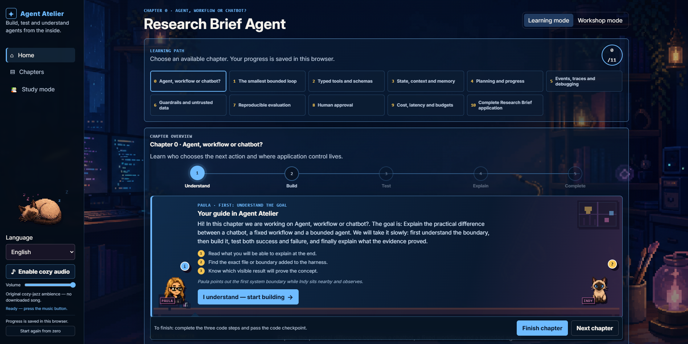
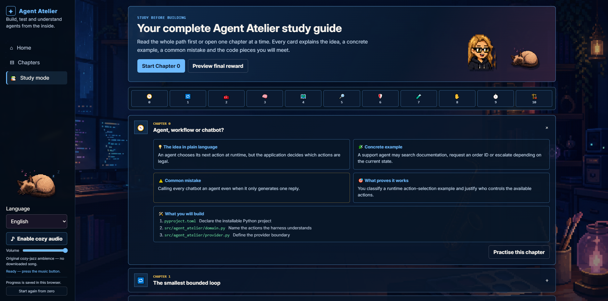
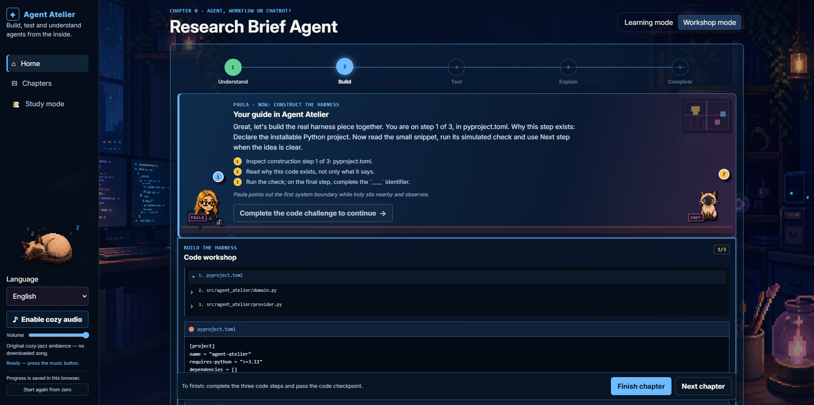
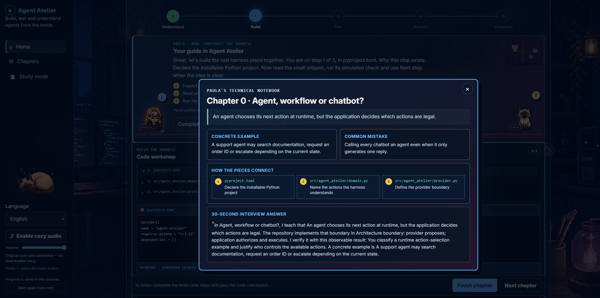
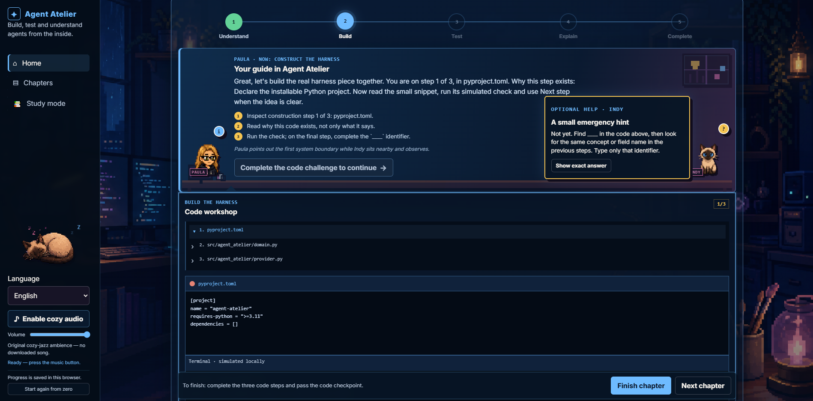
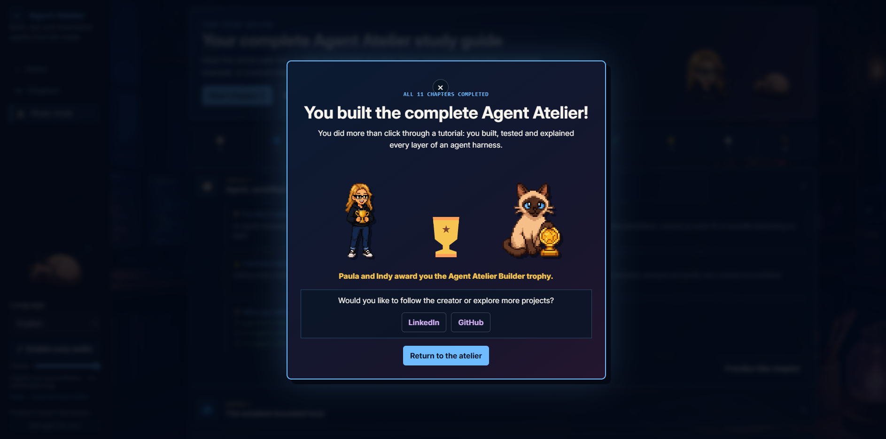
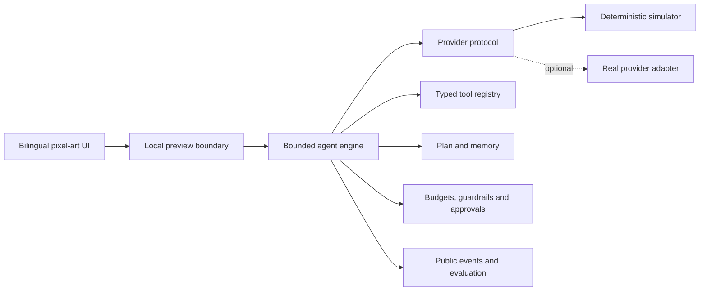

# Paula & Indy's Agent Atelier

**Learn how AI agents work by building the harness yourself.**

Paula & Indy's Agent Atelier is a bilingual, offline-first learning lab that turns agent architecture into an eleven-chapter, evidence-based workshop. Paula guides the technical story, Indy offers optional hints, and a cozy pixel-art studio grows with the learner.

[Leer en español](README.es.md) · [Learning path](docs/CHAPTER_MATRIX.md) · [Architecture](docs/architecture/overview.md) · [Design story](docs/DESIGN_STORY.md)



> No API key, internet connection or paid model is required for the complete default course.

## Why I built it

I created this personal portfolio project to make agent engineering less abstract. My goal was not to wrap a model in a chat screen, but to **gamify the process of understanding, building, testing and explaining an agent harness from the inside**.

The project brings together three parts of my profile: AI engineering, teaching and visual arts. The night-time pixel studio is inspired by my own creative workspace. Paula is a stylised guide inspired by me; Indy is inspired by my Siamese cat. Their roles are intentionally different: Paula explains concepts and connects them to real code, while Indy provides optional hints and only reveals an answer when the learner asks for it.

As chapters are completed, the studio and the learner's mental model grow together. The visual identity is personal, but every decorative choice supports a real technical learning objective.

## Why this project is different

Many agent demos hide the important decisions behind a framework. Agent Atelier keeps them visible and testable.

| The learner sees | The repository proves |
|---|---|
| An explicit agent loop | Step budgets, stop conditions and loop detection |
| Typed tool calls | Schema validation before execution |
| Plans, memory and public events | Application-owned state with safe boundaries |
| Success and failure cases | Deterministic tests and observable evidence |
| Cost, latency and approval controls | Independent policies that fail safely |
| A complete final agent | The same harness works offline or with an optional provider adapter |

The course does not expose private chain of thought. It teaches through designed explanations, validated actions, public events, tool results and reproducible tests.

## The learning experience

Every chapter follows one purposeful sequence:

**Understand → Build → Test → Explain → Complete**

- **Study Mode** introduces all concepts with examples and common mistakes before practice.
- **Learning Mode** keeps Paula's guidance and the chapter journey visible.
- **Workshop Mode** gives more space to code, commands and executable labs.
- Click **Paula** for a deeper technical notebook: the mental model, file connections, pitfalls and a concise technical summary.
- Click **Indy** for a contextual hint; reveal the exact answer only if you choose to.

Questions use guided choices instead of arbitrary typing. Wrong answers represent realistic misconceptions, and the feedback explains both the safer rule and the evidence that proves it.

## See the learning journey

### Study before building



Study Mode gives beginners a calm overview before they touch code. Each chapter connects one plain-language idea to a concrete example, a common mistake, observable proof and the real repository files they will build.

### Build the harness one visible step at a time



Workshop Mode turns the concept into a three-step construction. The learner inspects a small real file, understands why it exists, runs a deterministic check and completes a guided checkpoint. The interface never pretends that a simulated command contacted an external service.

### Ask for exactly the depth you need

| Paula's technical notebook | Indy's optional help |
|---|---|
|  |  |
| Paula explains how the pieces connect and condenses the lesson into an evidence-based technical summary. | Indy starts with a small contextual hint. The exact answer stays hidden behind a second deliberate action. |

### Finish with evidence, not just clicks



The final reward unlocks only after all eleven chapters are completed. It closes the learning story with an original trophy scene, optional reduced-motion-safe celebration and direct links to the creator's professional profiles.

## Meet the guides

| Paula · technical mentor | Indy · optional helper |
|---|---|
|  |  |
| Opens deeper explanations, code connections, pitfalls and technical summaries. | Offers a small hint first and reveals an answer only when the learner requests it. |

Read [the design story](docs/DESIGN_STORY.md) to see how the personal studio, characters and accessibility choices support the curriculum.

## What you build

| Chapter | Concept | Observable proof |
|---:|---|---|
| 0 | Agent, workflow or chatbot? | Identify who owns the next action |
| 1 | The smallest bounded loop | Complete safely or exhaust a step budget |
| 2 | Typed tools and schemas | Accept valid arguments and reject malformed ones |
| 3 | State, context and memory | Preserve session facts without leaking across sessions |
| 4 | Planning and progress | Advance only when a success condition is proven |
| 5 | Events, traces and debugging | Publish safe facts and redact secrets |
| 6 | Guardrails and untrusted data | Treat retrieved instructions as data, not authority |
| 7 | Reproducible evaluation | Run deterministic behavioural scenarios |
| 8 | Human approval | Consume one exact permission once |
| 9 | Cost, latency and budgets | Observe independent safety limits |
| 10 | Complete Research Brief Agent | Produce grounded or explicitly insufficient results |

The full code-to-test mapping lives in [the chapter matrix](docs/CHAPTER_MATRIX.md).

## Architecture at a glance



The provider is replaceable; the safety and learning boundaries remain owned by the application. See [the architecture overview](docs/architecture/overview.md) and [decision records](docs/decisions/).

## Try it in 60 seconds

### Friendly Windows launch

Double-click `OPEN_AGENT_ATELIER.bat`. The launcher starts the local server and opens `http://127.0.0.1:8765/web/`.

### Terminal launch

```bash
python -m pip install -e .
python -m agent_atelier.preview
```

The default simulator is free, deterministic and fully functional. To verify the repository before publishing, run `VERIFY_AGENT_ATELIER.bat` on Windows or:

```bash
python -m unittest discover -s tests -v
python -m agent_atelier.evaluate_cli
```

GitHub Actions repeats the tests, Python compilation, JavaScript syntax check and deterministic evaluation without secrets or model costs.

## Optional real provider, with a deliberate safety boundary

Chapter 10 can replace only the provider layer with an OpenAI adapter. The browser never asks for or receives a key. `OPEN_AGENT_ATELIER_REAL.bat` prompts locally, keeps the credential only in the server process and removes it when that process closes. A separate consent step warns that an external request may send data and generate costs.

Read [the real-provider guide](docs/REAL_PROVIDER.md) before enabling it. The simulator remains the recommended teaching, testing and CI path.

## Safety by construction

- bounded iterations and tool calls;
- typed schemas and an explicit tool allowlist;
- session-isolated memory;
- secret redaction and public-event allowlists;
- untrusted-content labelling;
- capability-scoped human approval;
- separate cost and latency budgets;
- grounded-evidence checks and honest insufficient-information results.

These are not decorative checklist items: every control appears in a chapter, implementation file, test and visible success/failure case.

## Repository map

```text
src/agent_atelier/   agent engine, providers, policies and bilingual catalogues
web/                 learning interface, study mode and accessible interactions
tutorials/           eleven English/Spanish lessons
tests/               unit, integration, security and learning-path checks
docs/                architecture, ADRs, curriculum and release material
assets/              original characters, background and procedural audio
```

## Suggested project tour

1. Open the interface and show the five-stage chapter journey.
2. Use Chapter 2 to demonstrate schema validation before a tool handler runs.
3. Open Paula's technical notebook to connect the UI lesson to real files and tests.
4. Run one success case and one blocked case; explain why both are valuable evidence.
5. Finish with Chapter 10 and the deterministic evaluation report.

The architecture overview and decision records provide the deeper technical context behind this tour.

## Visual story

Every screenshot above was captured from the real local application. Together they show the complete learning loop: orient, study, build, request help, explain and complete. The interface uses one original studio, character and design-token system throughout the repository.

Project asset credits are documented in [ASSET_CREDITS.md](ASSET_CREDITS.md); no Pinterest, commercial game or stock assets are shipped.

## Honest limitations

- The default provider and evidence corpus are intentionally small and deterministic.
- The optional real adapter is limited to the final integrated chapter.
- There is no hosted demo, live web search or database-backed long-term memory yet.
- The current course teaches one agent loop; concurrency, retries and multi-user deployment belong in an advanced follow-up, not the beginner path.
- The repository is shared as a viewable portfolio project; reuse requires permission. AI-assisted visual outputs may not be unique.

## Creator

Designed and built by **Paula García Fernández** as a personal portfolio project joining AI engineering, teaching and visual design.

[LinkedIn](https://www.linkedin.com/in/paula-garcia-fernandez-pgf3712) · [GitHub](https://github.com/pgf3712)

Copyright terms are documented in [COPYRIGHT.md](COPYRIGHT.md), and project asset credits in [ASSET_CREDITS.md](ASSET_CREDITS.md).
